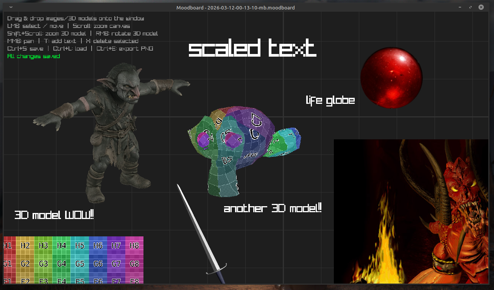
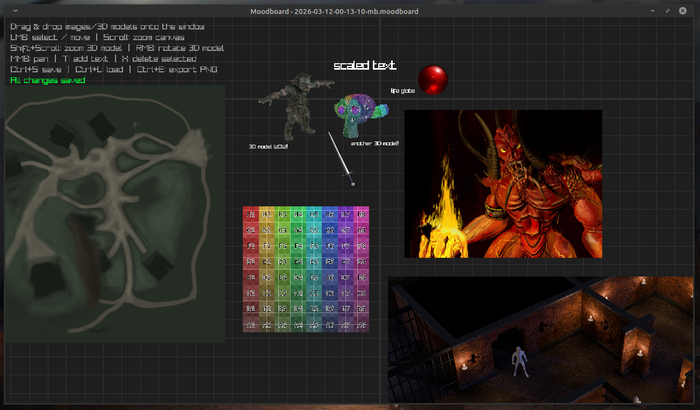

# Moodboard

A fast, lightweight, and interactive digital moodboard application written in [Odin](https://odin-lang.org/) and powered by [Raylib](https://www.raylib.com/).

Moodboard allows you to quickly lay out images and text on an infinite 2D canvas. Whether you're brainstorming a design, planning a level, or just throwing ideas together, it's designed to stay out of your way and let you work efficiently.

## Features

- **Infinite Canvas**: Pan and zoom around a free-form workspace.
- **Drag & Drop support**: Easily drag images (.png, .jpg) or **3D models** (.obj, .gltf, .glb) directly into the application window.
- **3D Model Integration**: Models are rendered into 2D frames that can be moved and scaled alongside images.
- **Interactive Manipulation**:
    - **Resize Handles**: Drag the blue handle at the bottom-right of any item to scale it proportionally.
    - **Quick Reset**: Double-click a resize handle to restore an item's original size.
    - **3D Rotation**: Right-click and drag a selected 3D model to rotate it in space.
    - **Camera Zoom**: Shift + Scroll on a selected model to zoom its internal 3D camera.
- **Text Annotation**: Click to type text notes anywhere on the board.
- **Robust Save System**: Boards are saved to a plain text `.moodboard` format.
- **Auto-Export to PNG**: Render your entire board to a high-quality `.png` image with a single keystroke (`Ctrl+E`).





## Controls

| Action | Input |
| --- | --- |
| **Select / Move item** | `Left Mouse Button` (Click & Drag) |
| **Resize Item** | `Left Mouse Button` on **Blue Handle** (Drag) |
| **Reset Size** | `Double Click` on **Blue Handle** |
| **Rotate 3D Model** | `Right Mouse Button` (while model selected) |
| **3D Camera Zoom** | `Shift + Mouse Wheel` (while model selected) |
| **Pan camera** | `Middle Mouse Button` (Hold & Drag) |
| **Zoom Canvas** | `Mouse Wheel` |
| **Reset Zoom (1x)** | `1` |
| **Set Zoom (0.5x)** | `2` |
| **Center Camera** | `C` |
| **Add Text** | `T` (Starts typing mode, press `Enter` to place, `Esc` to cancel) |
| **Delete Selected** | `X` |
| **Save Board** | `Ctrl + S` |
| **Reload Board** | `Ctrl + L` |
| **Export to PNG** | `Ctrl + E` |

## Getting Started

### Prerequisites

To build and run from source, you will need:
- The [Odin Compiler](https://odin-lang.org/) installed.
- Dependecies required by `vendor:raylib` (usually just basic OpenGL/X11 development libraries on Linux).

### Building

You can quickly compile the application using the Odin CLI:

```bash
odin build src -out:moodboard
```

### Running

To launch a new, fresh moodboard:

```bash
./moodboard
```

*Note: By default, this creates a new save file uniquely named based on the current timestamp (e.g., `YYYY-MM-DD-HH-MM-SS-mb.moodboard`).*

To load an existing board file, simply pass the path as an argument:

```bash
./moodboard ./saves/my_board.moodboard
```

## Known Limitations

- **This is slopware, use at your own risk.**
- Multi-line text inputs are not currently supported in the typing interface natively.
- Image paths in `.moodboard` files are saved as absolute paths from where they were dragged. Moving the image files externally may cause them to display as "failed to load".

Probably should be refactored but for now treat is as vibe coded proof of concept.

## License

This project is open-source. Feel free to use, modify, and distribute!
